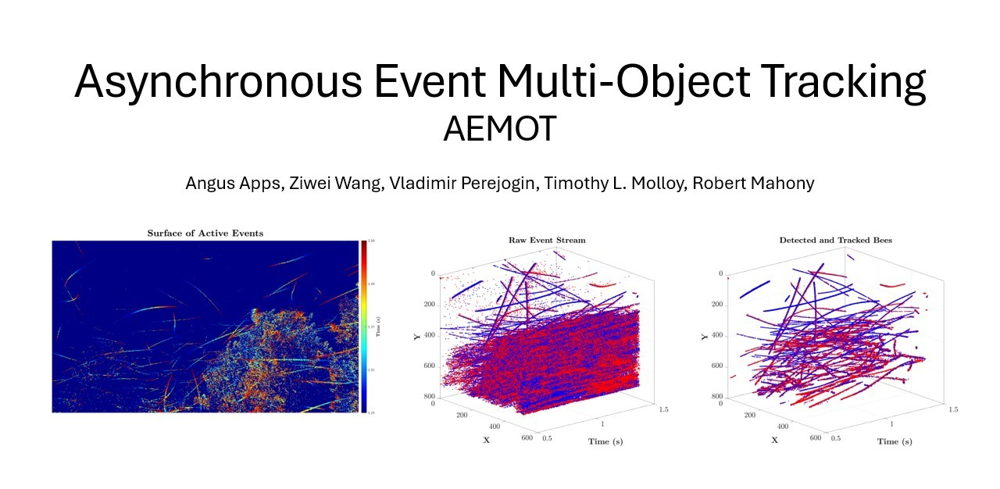

# Asynchronous Multi-Object Tracking with an Event Camera

The official repository for "Asynchronous Multi-Object Tracking with an Event Camera". More to come soon.

<!-- <video src="./supplementary/AEMOT_supplementary_video_2025.mp4" controls="controls" style="MAX;"></> -->

[Watch the supplementary video](./supplementary/AEMOT_supplementary_video_2025.mp4)

## For academic use only
Events cameras are ideal sensors for enabling robots to detect and track objects in highly dynamic environments due to their low latency output, high temporal resolution, and high dynamic range.
In this paper, we present the Asynchronous Event Multi-Object Tracking (AEMOT) algorithm for detecting and tracking multiple objects by processing individual raw events asynchronously.
AEMOT detects salient event blob features by identifying regions of consistent optical flow using a novel Field of Active Flow Directions built from the Surface of Active Events.
Detected features are tracked as candidate objects using the recently proposed Asynchronous Event Blob (AEB) tracker in order to construct small intensity patches of each candidate object.
A novel learnt validation stage promotes or discards candidate objects based on classification of their intensity patches, with promoted objects having their position, velocity, size, and orientation estimated at their event rate.
We evaluate AEMOT on a new Bee Swarm Dataset, where it tracks dozens of small bees with precision and recall performance exceeding that of alternative event-based detection and tracking algorithms by over 37%.

This paper was accepted by the 2025 IEEE International Conference on Robotics and Automation (ICRA).

Angus Apps, Ziwei Wang, Vladimir Perejogin, Timothy L. Molloy, and Robert Mahony

